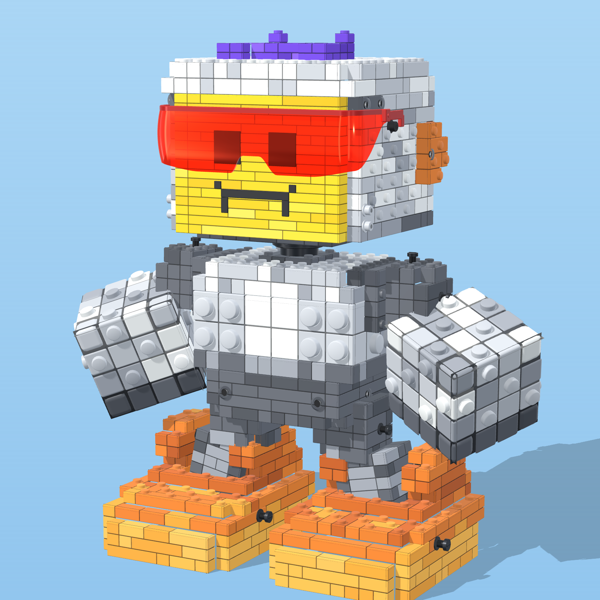
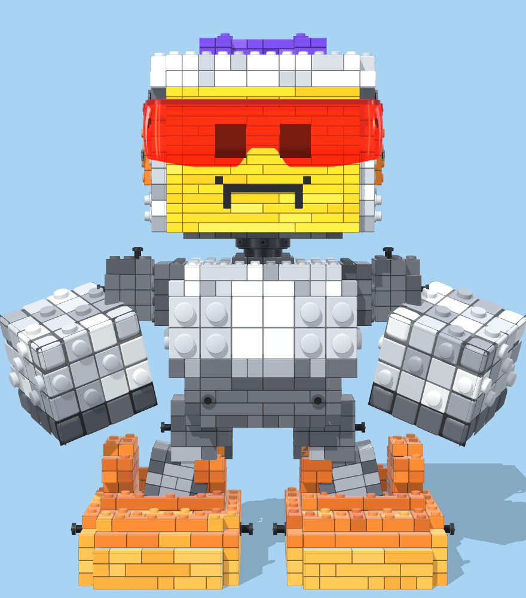
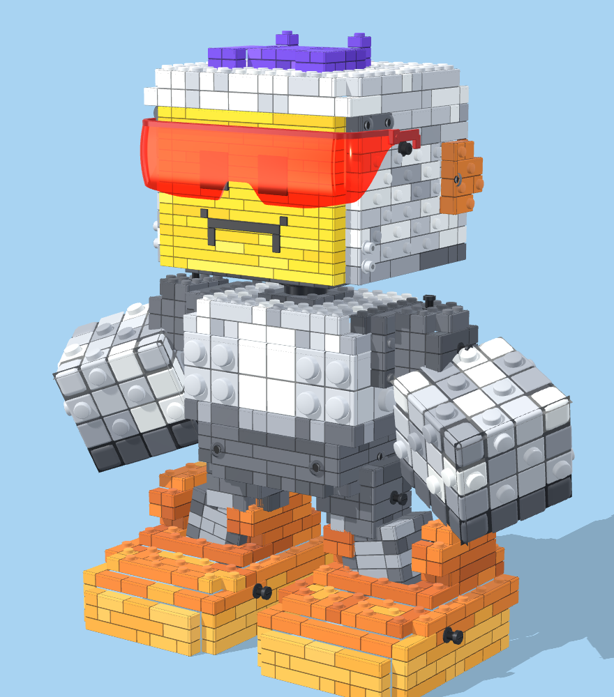
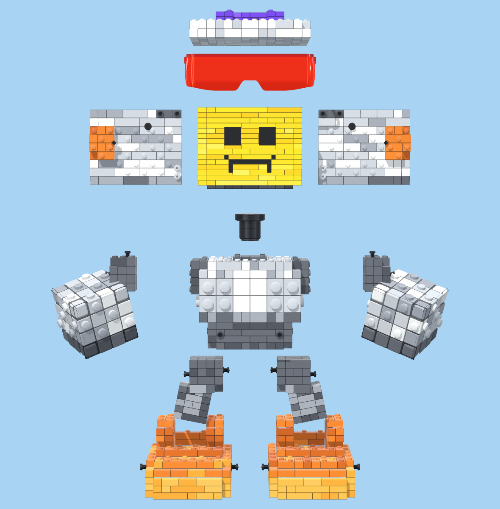

# PIXEL MECH™ — модульный коллекционный

Фигурка из кирпичиков: пиксельное лицо, красные зеркальные очки-щиток, фиолетовый 8-битный пришелец в шапке-черепе, кулаки-кубы и ступенчатые оранжевые ступни с болтами-осями.



| Спереди | 3/4 | Разобранный вид |
|---|---|---|
|  |  |  |

## Файлы

| Файл | Что это |
|---|---|
| `pixel-mech.glb` | готовая модель glTF 2.0 (≈6 МБ, ≈146 тыс. вершин): цвета в вершинах, детали отдельными узлами |
| `index.html` | интерактивный вьювер: вращение, мимика, разобранный вид с подписями, снимок PNG, выгрузка GLB |
| `src/pixel-mech.js` | генератор модели (three.js r128) — единственный источник геометрии |
| `tools/build.mjs`, `tools/render.html` | сборка: рендеры для листа в `renders/` и экспорт `pixel-mech.glb` |
| `renders/` | рендеры ракурсов листа-образца (вид спереди, 3/4, детали, модули, разобранный вид) |

## Как смотреть

Открой `index.html` в браузере (нужен интернет для three.js с CDN). Если браузер не грузит скрипт с диска, подними локальный сервер: `npx serve .` и открой адрес из консоли.

`pixel-mech.glb` открывается в Blender (Файл → Импорт → glTF 2.0), Godot, Unity (glTFast) и в онлайн-просмотрщиках.

## Как пересобрать

```bash
npm install
npm run build        # рендеры + pixel-mech.glb
npm run renders      # только картинки
node tools/build.mjs --view=front,three4   # отдельные ракурсы
```

Нужен Chromium: скрипт берёт его из `CHROME_PATH`, `PLAYWRIGHT_BROWSERS_PATH` или обычной установки Playwright.

## Устройство модели

Масштаб: шаг шипа 0.8, пол — `y = 0`, лицом к `+z`. Высота с пришельцем ≈ 28.

Каждая деталь — воксельная сетка со своим шагом клетки; видимые клетки превращаются в кирпичи 1×1…1×6 с перевязкой рядов, фаской и небольшим разбросом тона. За каждым кирпичом стоит тёмная подложка, поэтому швы читаются как настоящие зазоры. Шипы — точёные, в том числе боковые (SNOT). Техник-втулки, штифты, болты-оси, шея-штырь и очки — отдельная геометрия.

| Узел | Деталь | Как сделано |
|---|---|---|
| `shapka` | шапка-череп | белая кладка с шипами, пришелец 8×6 из фиолетовых плиток, рожки с шипами, глазницы — утопленные чёрные плитки |
| `ochki` | очки | щиток с дугой вокруг головы, выпуклый по вертикали, переносица-вырез, оправа-бровь, дужки с петлями до шарнира на боковой плите |
| `lico` | лицевая панель | жёлтая кладка тонкими рядами (0.48), глаза и 8-битный рот — отдельные чёрные плитки (для мимики) |
| `bokL`, `bokR` | боковые плиты | бело-серые кирпичи с боковыми шипами, оранжевое «ухо», тёмные техник-втулки, светлые штифты |
| `sheya` | шея-штырь | воронёный металл: воротник с пятью винтами, штырь с канавкой |
| `korpus` | корпус | таз, пояс, грудь из макро-блоков 1.6 с крупными шипами (8 спереди), белая центральная панель, плечевые колодки |
| `rukaL`, `rukaR` | руки | тёмное плечо с осями и кулак 4×4×4 из макро-блоков 1.42 со скруглёнными углами |
| `nogaL`, `nogaR` | ноги | бедро и наклонная голень, оси в тазовом и плечевом суставах |
| `stupnyaL`, `stupnyaR` | ступни | три оттенка оранжевого ступеньками, вилка-кронштейн под голень, болты-оси |

Материалы в GLB: `abs_plastic` (цвета вершин), `black_tile`, `gunmetal`, `sunglass_lens` (прозрачный), `sunglass_frame`. Во вьювере линза очков рисуется как тонировка умножением плюс зеркальные блики — глаза видны сквозь красный, как на листе.

Палитра (sRGB): белый `#eceeec`, светло-серый `#c3c7cc`, средне-серый `#9ba0a8`, тёмно-серый `#5f636b`, жёлтый `#f7d11a`, фиолетовый `#6d40d8`, оранжевые `#e57d25` / `#cf661b` / `#f0a232` / `#f6b547`.
